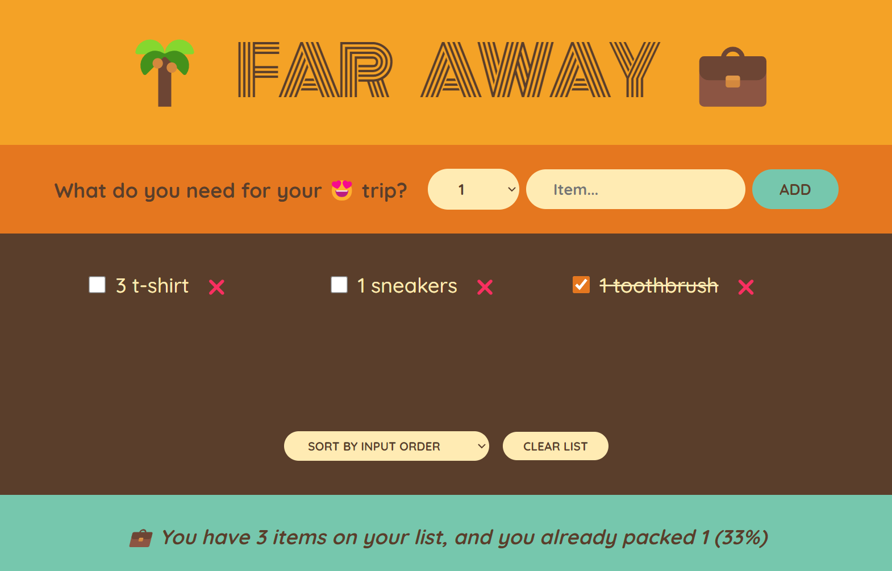

# Trip Packing List App

A simple React web application that allows users to create a list of items needed for a trip, mark items as packed by crossing them out, and sort the list. This project is part of the Udemy course **[The Ultimate React Course 2024: React, Next.js, Redux & More](https://www.udemy.com/course/the-ultimate-react-course/)**.

## Features

- **Add Items**: Easily add items to your packing list.
- **Mark as Packed**: Cross out items once they are packed.
- **Sort Items**: Sort your list by input order, description, or packed status.
- **Delete Items**: Remove individual items from the list.
- **Clear List**: Delete all items to start a new list.

